# AWS Highly Available Web Application

A production-style AWS architecture demonstrating **High Availability**, **Scalability**, **Security**, and **Monitoring** using AWS managed services.

---

## 📖 Project Overview

This project demonstrates how to deploy a highly available web application on AWS following cloud architecture best practices.

The infrastructure is distributed across **two Availability Zones** to improve availability and fault tolerance.

The solution includes:

- Multi-AZ VPC Design
- Public and Private Subnets
- Internet Gateway
- NAT Gateways
- Application Load Balancer
- Auto Scaling Group
- Amazon EC2
- Amazon RDS Multi-AZ
- Amazon CloudFront
- AWS WAF
- Amazon Route 53
- Amazon CloudWatch
- Amazon SNS
- AWS Systems Manager Session Manager

---

## 🏗️ Solution Architecture

---

# ☁️ AWS Services Used

| Service | Purpose |
|----------|----------|
| Amazon VPC | Creates an isolated virtual network for the application. |
| Public Subnets | Host internet-facing resources such as the Application Load Balancer and NAT Gateways. |
| Private Application Subnets | Host the EC2 application servers securely without public IP addresses. |
| Private Database Subnets | Host the Amazon RDS database instances. |
| Internet Gateway | Provides internet connectivity for public resources. |
| NAT Gateway | Allows private EC2 instances to access the internet securely. |
| Amazon EC2 | Runs the Apache web application. |
| Application Load Balancer | Distributes incoming traffic across multiple EC2 instances. |
| Auto Scaling Group | Automatically scales EC2 instances based on demand. |
| Amazon RDS (Multi-AZ) | Provides a highly available managed MySQL database. |
| Amazon CloudFront | Delivers content globally with low latency. |
| AWS WAF | Protects the application from common web attacks. |
| Amazon Route 53 | Provides DNS management and routing. |
| Amazon CloudWatch | Collects metrics and monitors AWS resources. |
| Amazon SNS | Sends email notifications when alarms are triggered. |
| AWS Systems Manager | Provides secure instance management without SSH. |

---

# 🏛️ Architecture Overview

The solution is designed following AWS Well-Architected Framework best practices.

The application is deployed across two Availability Zones to provide high availability and fault tolerance.

The Application Load Balancer distributes incoming traffic across EC2 instances running inside private application subnets.

Amazon RDS is deployed in Multi-AZ mode to ensure database availability.

CloudFront accelerates content delivery while AWS WAF protects the application from malicious requests.

CloudWatch monitors infrastructure metrics and sends alerts through Amazon SNS.

AWS Systems Manager Session Manager provides secure access to EC2 instances without opening SSH ports.

---

# 🌐 Traffic Flow

The following sequence describes how a user request travels through the architecture:

1. The user accesses the application using a custom domain.
2. Amazon Route 53 resolves the domain name.
3. The request is routed to Amazon CloudFront.
4. AWS WAF inspects incoming requests and filters malicious traffic.
5. CloudFront forwards the request to the Application Load Balancer (ALB).
6. The ALB distributes traffic across healthy EC2 instances in the private application subnets.
7. EC2 instances communicate with Amazon RDS in the private database subnets when database access is required.
8. The response is returned through the same path back to the user.

---

# 🌍 Network Design

The network architecture is deployed inside a single Amazon VPC spanning two Availability Zones.

### Public Subnets

- Application Load Balancer
- NAT Gateway
- Internet Gateway connectivity

### Private Application Subnets

- Amazon EC2 instances
- Auto Scaling Group

### Private Database Subnets

- Amazon RDS Multi-AZ deployment

This design isolates application and database resources from direct internet access while allowing secure outbound internet connectivity through NAT Gateways.

---

# 🔒 Security

The infrastructure follows AWS security best practices.

- EC2 instances do not have public IP addresses.
- Database instances are deployed in private subnets.
- Security Groups restrict traffic between ALB, EC2, and RDS.
- AWS WAF protects the application from common web attacks.
- AWS Systems Manager Session Manager is used instead of SSH.

---

# 📈 High Availability

The application is designed for fault tolerance.

- Multi-AZ deployment
- Application Load Balancer
- Auto Scaling Group
- Amazon RDS Multi-AZ
- CloudFront global edge locations
- NAT Gateway in each Availability Zone

If one Availability Zone becomes unavailable, traffic is automatically routed to healthy resources in the remaining Availability Zone.

---

# 📷 Deployment Screenshots

## Solution Architecture

---

## VPC

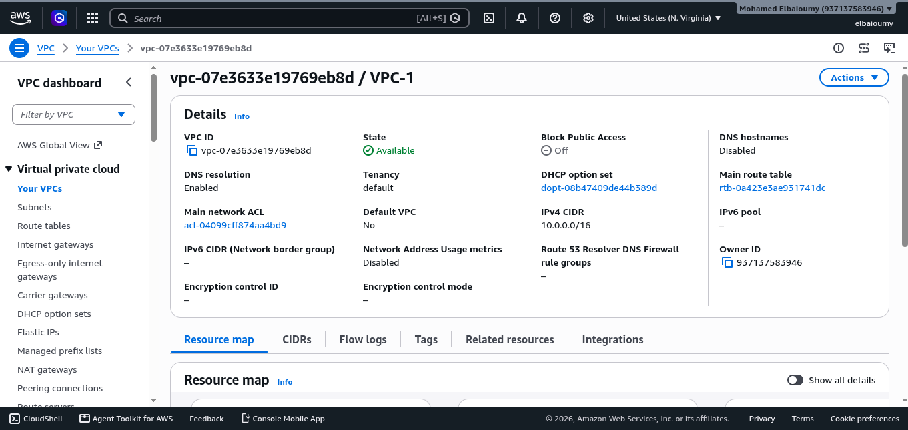

## Subnets

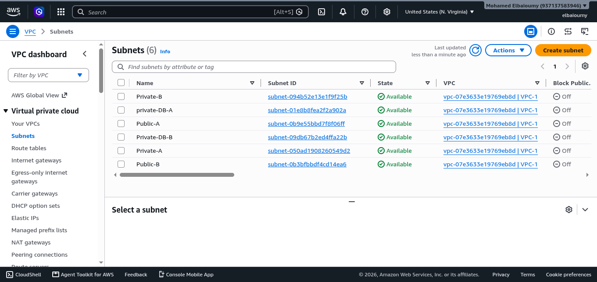

## Route Tables

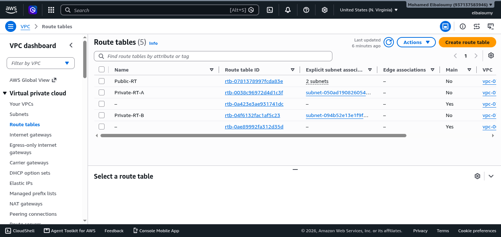

## Internet Gateway

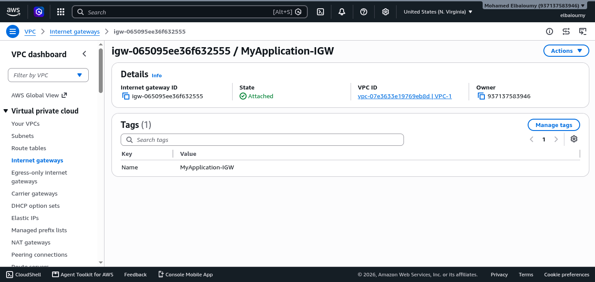

## NAT Gateways

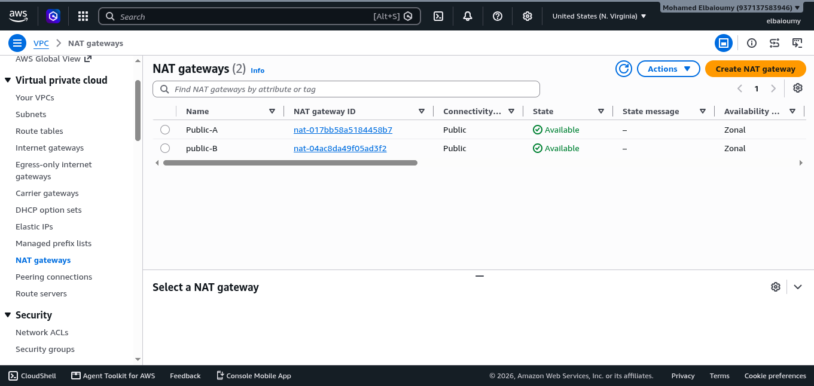

---

## Application Load Balancer

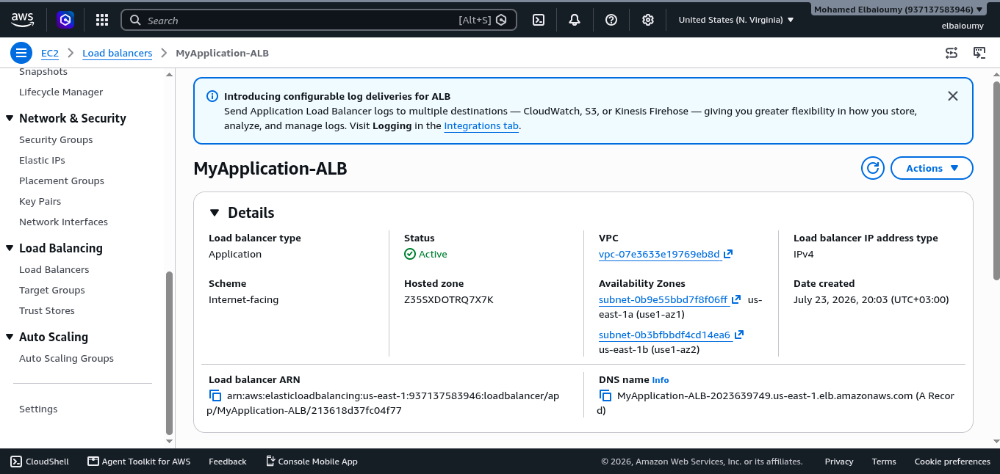

## ALB Listeners

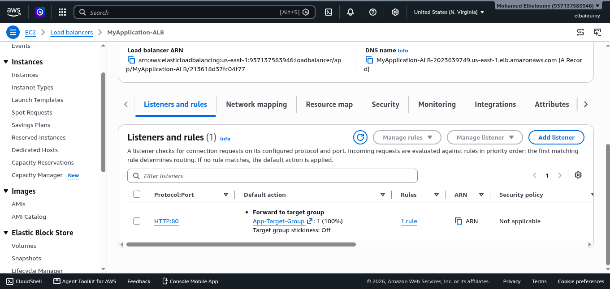

## Auto Scaling Group

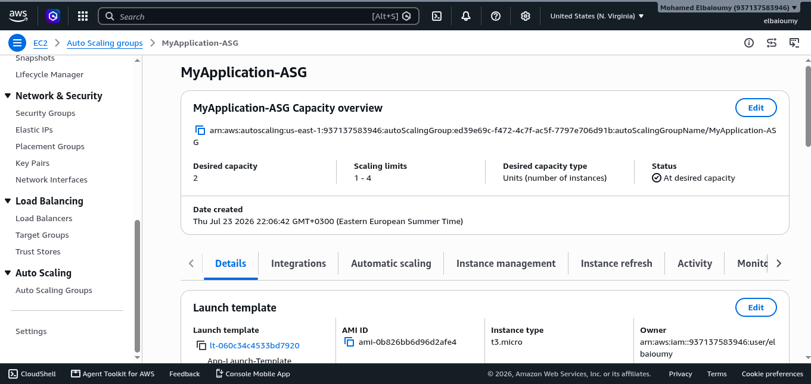

## Launch Template

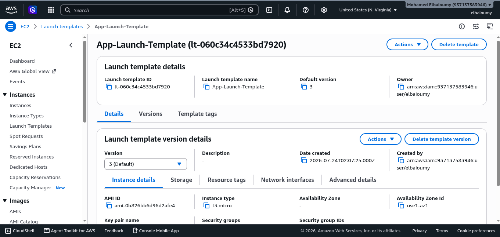

## EC2 Instances

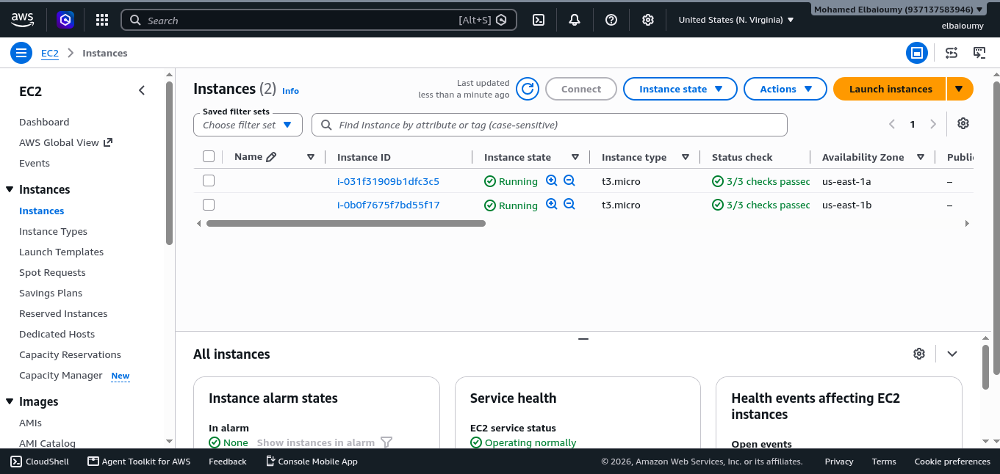

## Target Group

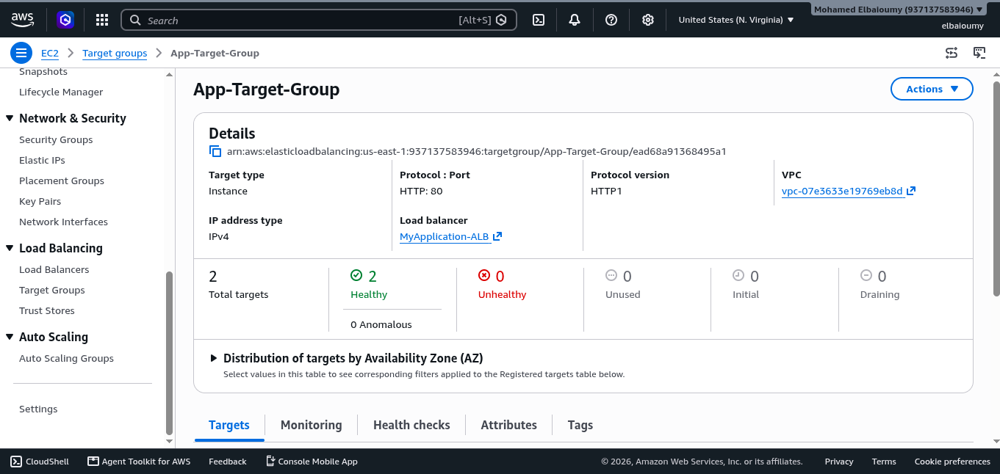

## Target Group Health

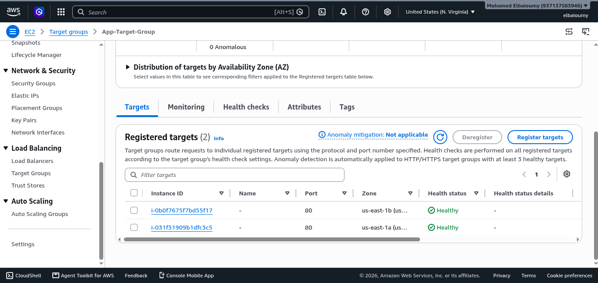

---

## Amazon RDS

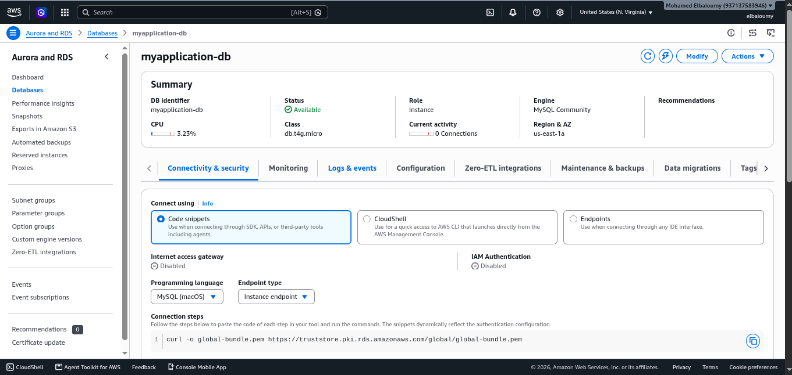

---

## CloudFront

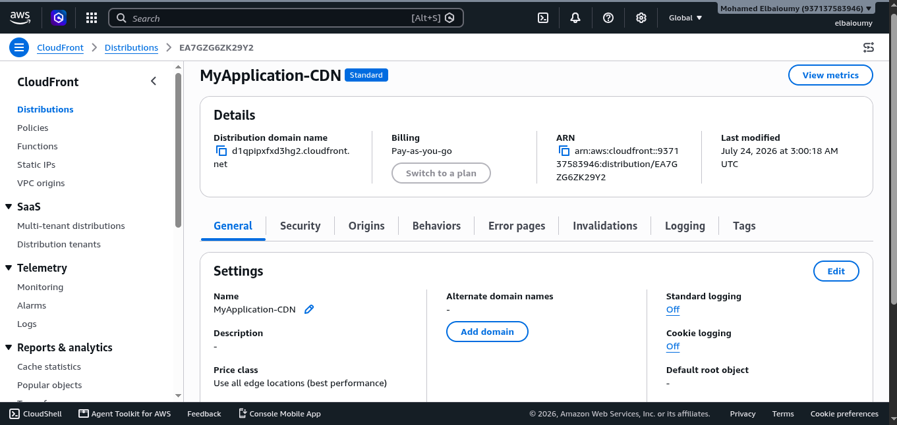

## Route 53

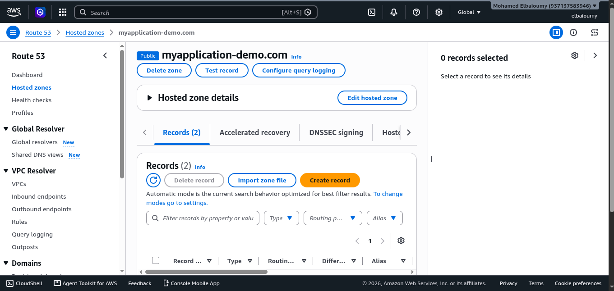

## Application

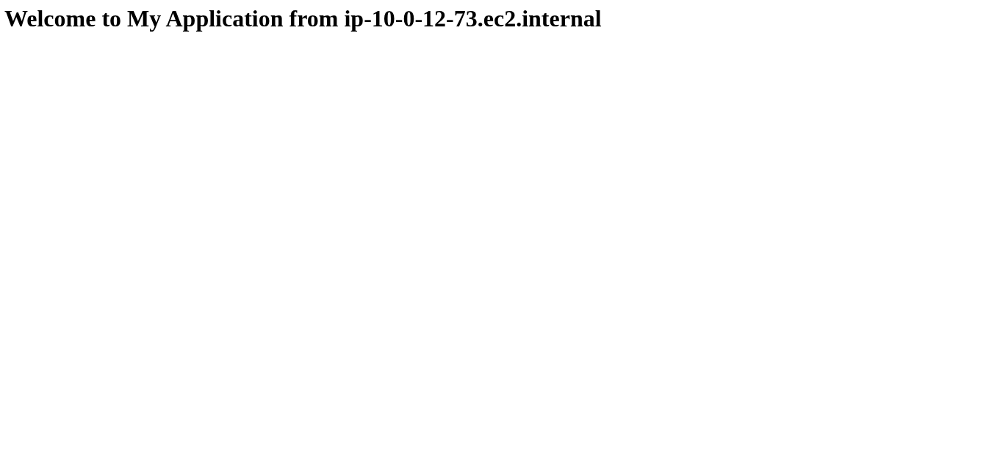

---

## AWS WAF

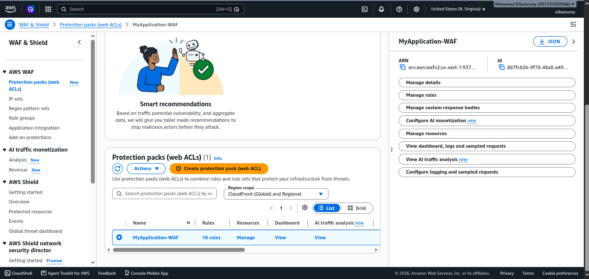

## ALB Security Group

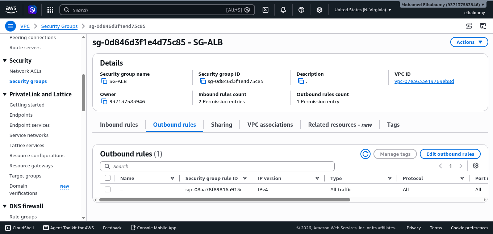

## Application Security Group

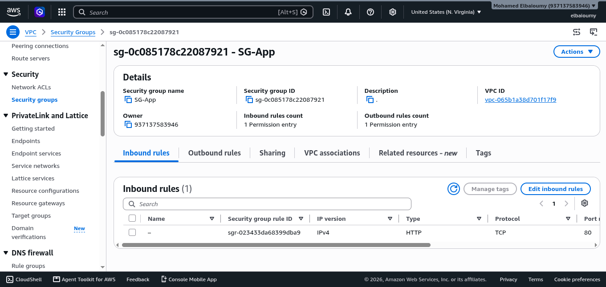

## Database Security Group

---

## CloudWatch

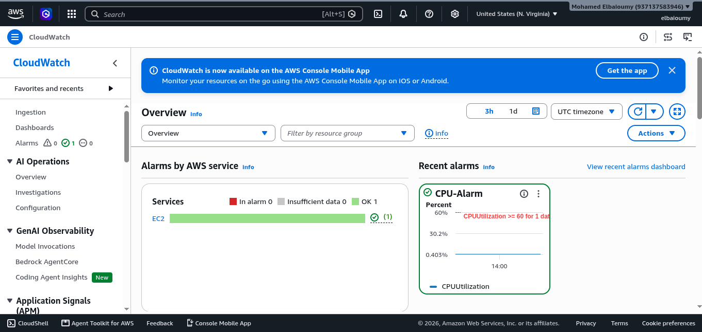

## SNS

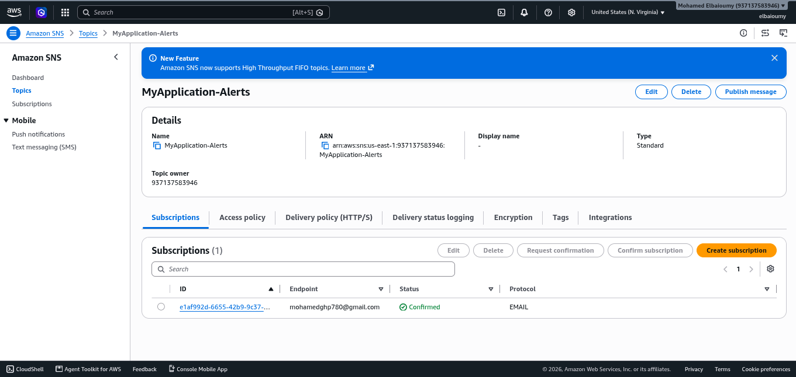

---

# 👨‍💻 Author

**Mohamed Ahmed Elbaioumy**

- GitHub: https://github.com/Elbaioumy
- LinkedIn: https://www.linkedin.com/in/mohamed-elbaioumy/

---

⭐ If you found this project useful, consider giving it a star.
