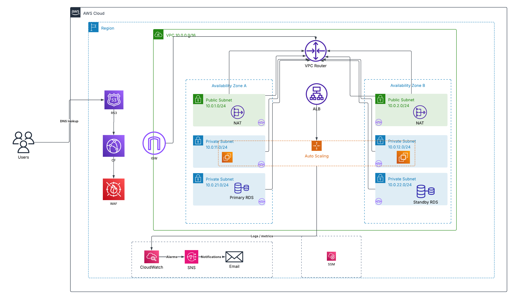

# AWS Highly Available Web Application

A production-style AWS architecture demonstrating **High Availability**, **Scalability**, **Security**, and **Monitoring** using AWS managed services.

---

## 📖 Project Overview

This project demonstrates how to deploy a highly available web application on AWS following cloud architecture best practices.

The infrastructure is distributed across **two Availability Zones** to improve availability and fault tolerance.

The solution includes:

- Multi-AZ VPC Design
- Public and Private Subnets
- Internet Gateway
- NAT Gateways
- Application Load Balancer
- Auto Scaling Group
- Amazon EC2
- Amazon RDS Multi-AZ
- Amazon CloudFront
- AWS WAF
- Amazon Route 53
- Amazon CloudWatch
- Amazon SNS
- AWS Systems Manager Session Manager

---

## 🏗️ Solution Architecture

